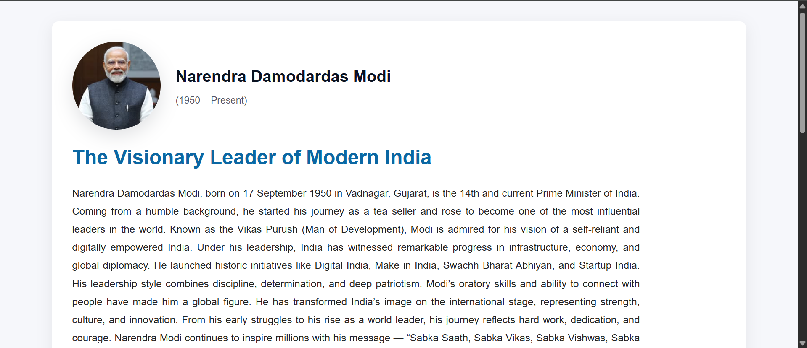
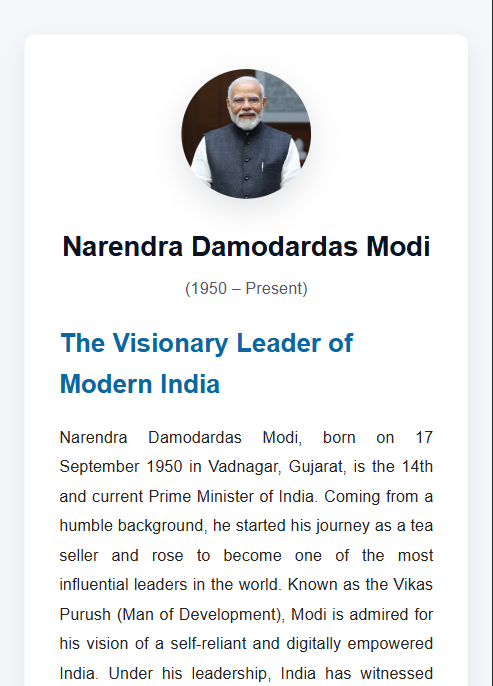

# 🌐 Modi Tribute — HTML & CSS Project

A simple yet elegant **Tribute Website** dedicated to *Shri Narendra Modi*, built using pure **HTML** and **CSS**.  
This project focuses on clean design, responsive layout, and semantic structure — perfect for learning and showcasing frontend fundamentals.

---

## 📖 About the Project
This project marks the **beginning of my Frontend Development Journey (Day 1)** 🚀  
It helped me strengthen my understanding of semantic HTML, CSS styling, and responsive layouts.

The website includes:
- 📜 Detailed biography and key milestones of Narendra Modi  
- 🧭 Modern layout with smooth spacing and typography  
- 🔗 A "Read More" section linking to his official Wikipedia page  
- 💻 Fully responsive design — optimized for both desktop and mobile screens  

---

## 🧰 Tech Stack
- ⚙️ **HTML5** — for structure and semantics  
- 🎨 **CSS3** — for styling and responsive design  
- 🧑‍💻 **Git & GitHub** — for version control and deployment  

---

## 🚀 Live Demo
🔗 [Click here to view the live site](https://roshan0011830.github.io/modi-tribute/)

> Hosted on **GitHub Pages** — accessible across all devices 🌍

---

## 📱 Responsive Views

### 🖥️ Desktop View


### 📲 Mobile View


> The design automatically adjusts to different screen sizes for an optimal user experience.

---

## 🧩 How to Run Locally

1. Clone this repository  
   ```bash
   git clone https://github.com/roshan0011830/modi-tribute.git
